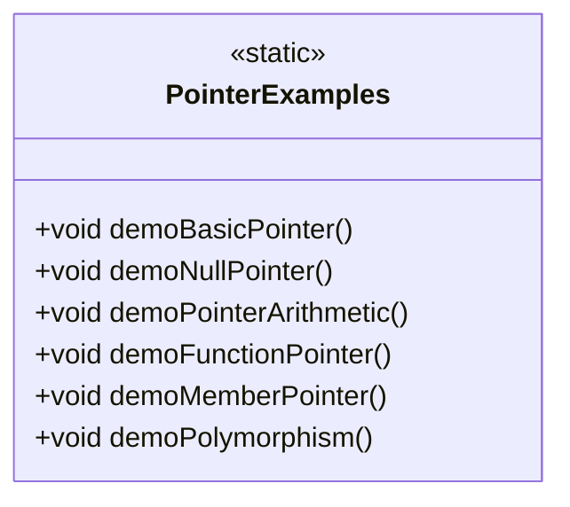

# Arquitectura del Proyecto

Descripción de la arquitectura.

```mermaid
classDiagram
    class PointerExamples {
        <<static>>
        +void demoBasicPointer()
        +void demoNullPointer()
        +void demoPointerArithmetic()
        +void demoFunctionPointer()
        +void demoMemberPointer()
        +void demoPolymorphism()
    }
```